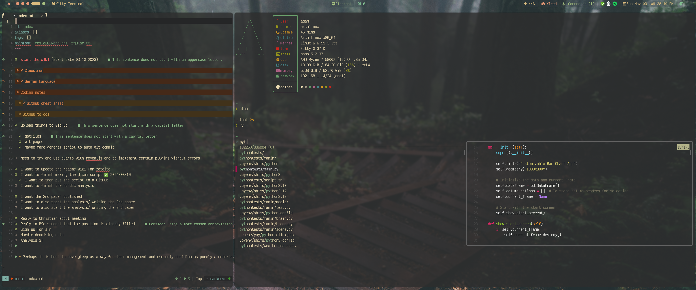
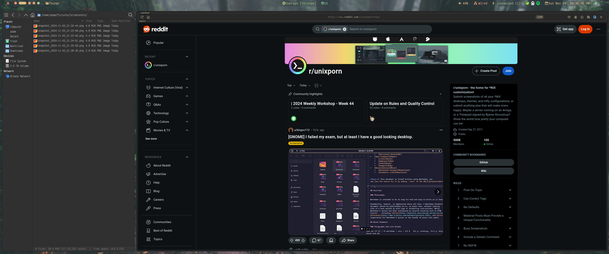

# archdotfiles
Arch dotfiles. Using: 

- WM: Hyprland

- Bar: ags (hyprpanel)

- Launcher: rofi

- Display manager: SDDM 

- Terminal: Kitty

- Wallpaper: This beauty here

- Icon Theme: MoreWaita

- Fonts: VictorMono Nerd Font Mono

- File Manager: Thunar

- Resource Monitor: Btop

- Fetch: Fastfetch

- Colorscheme: Gruvbox 

- Browser: Firefox ([textfox](https://github.com/adriankarlen/textfox) [sideberry](https://github.com/mbnuqw/sidebery) )

- Screenshots: Grimblast

---

- WIP!! 
    - Updating the installation and configuration in the coming weeks
    - Remove and overhaul the use of redundant packages in favour of `ags` 
